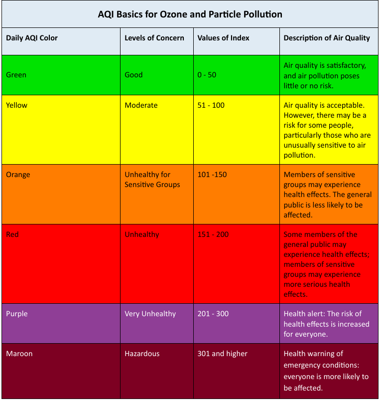
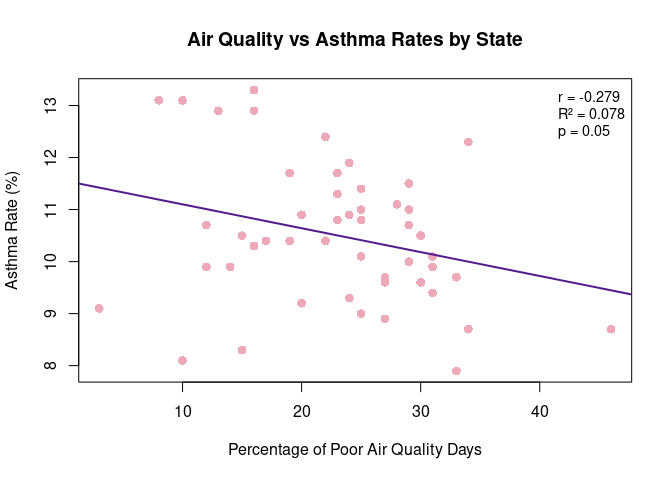

Group Project
================
Elise Johnson
2025-11-22

- [ABSTRACT](#abstract)
- [BACKGROUND](#background)
- [STUDY QUESTION and HYPOTHESIS](#study-question-and-hypothesis)
  - [Questions](#questions)
  - [Hypothesis](#hypothesis)
  - [Prediction](#prediction)
- [METHODS/RESULTS](#methodsresults)
  - [1st Analysis](#1st-analysis)
  - [2nd Analysis](#2nd-analysis)
- [DISCUSSION](#discussion)
  - [Interpretation of 1st analysis](#interpretation-of-1st-analysis)
  - [Interpretation of 2nd analysis](#interpretation-of-2nd-analysis)
- [CONCLUSION](#conclusion)
- [REFERENCES](#references)

# ABSTRACT

# BACKGROUND

Asthma is a lung condition that causes difficulty in breathing due to
constricted airways in the lungs. It can be worsened by indoor and
outdoor air pollution from factors such as temperature, humidity, wind,
building material emissions, and smoke. Pollutants such as particulate
matter, ozone, nitrogen dioxide, sulfur dioxide, and carbon monoxide are
also linked to worsening asthma symptoms (AAAAI). Poor air quality can
impact those who suffer from asthma by causing their condition to worsen
and trigger attacks (Tiotiu). The aim of this analysis is to determine
if poor air quality is correlated to higher rates of asthma, as opposed
to just worsening it. We hypothesized that air quality is correlated
with asthma. We predicted that the states with the highest number of
poor air quality days would also have the highest prevalence of asthma
in adults.

``` r
# Load the data
air_data <- data.frame(
  State = c("Alabama", "Alaska", "Arizona", "Arkansas", "California", "Colorado", "Connecticut", "Delaware", "Florida", "Georgia", "Hawaii", "Idaho", "Illinois", "Indiana", "Iowa", "Kansas", "Kentucky", "Louisiana", "Maine", "Maryland", "Massachusetts", "Michigan", "Minnesota", "Mississippi", "Missouri", "Montana", "Nebraska", "Nevada", "New Hampshire", "New Jersey", "New Mexico", "New York", "North Carolina", "North Dakota", "Ohio", "Oklahoma", "Oregon", "Pennsylvania", "Rhode Island", "South Carolina", "South Dakota", "Tennessee", "Texas", "Utah", "Vermont", "Virginia", "Washington", "West Virginia", "Wisconsin", "Wyoming"),
  Poor_Air = c(0.27, 0.12, 0.33, 0.3, 0.46, 0.25, 0.22, 0.31, 0.24, 0.3, 0.03, 0.28, 0.34, 0.25, 0.27, 0.29, 0.23, 0.29, 0.08, 0.19, 0.23, 0.24, 0.14, 0.31, 0.22, 0.19, 0.1, 0.25, 0.1, 0.27, 0.22, 0.16, 0.2, 0.17, 0.25, 0.34, 0.29, 0.31, 0.16, 0.25, 0.15, 0.23, 0.33, 0.29, 0.13, 0.12, 0.24, 0.16, 0.2, 0.15),
  Asthma = c(9.6, 10.7, 9.7, 10.5, 8.7, 10.8, 12.4, 9.9, 9.3, 9.6, 9.1, 11.1, 8.7, 11, 9.7, 10.7, 10.8, 10, 13.1, 10.4, 11.3, 11.9, 9.9, 9.4, 10.4, 11.7, 8.1, 10.1, 13.1, 8.9, 10.4, 10.3, 9.2, 10.4, 11.4, 12.3, 11.5, 10.1, 13.3, 9, 8.3, 11.7, 7.9, 11, 12.9, 9.9, 10.9, 12.9, 10.9, 10.5)
)
```

``` r
# Use the existing air_data from our environment
# Convert to appropriate format and calculate percentages
df <- data.frame(
  State = air_data$State,
  asthma_pct = air_data$Asthma,
  poor_air_pct = air_data$Poor_Air * 100  # Convert proportion to percentage
)

# Sort by asthma percentage (descending)
df <- df[order(-df$asthma_pct), ]

# Set up plotting parameters
par(mar = c(5, 10, 4, 6))  # Adjust margins for state names
y_pos <- 1:nrow(df)  # Y positions for bars

# Create empty plot
plot(0, 0, type = "n", 
     xlim = c(0, 50), 
     ylim = c(0.5, nrow(df) + 0.5),
     xlab = "Percent", 
     ylab = "",
     main = "Adults with Current Asthma vs. Poor-Air Days by State\n(Ranked by Asthma %)",
     yaxt = "n")  # No default y-axis

# Add asthma bars (blue)
barplot_height <- df$asthma_pct
rect(xleft = 0, ybottom = y_pos - 0.3, 
     xright = barplot_height, ytop = y_pos + 0.3,
     col = "lightblue", border = NA)

# Add air quality bars (red) - offset slightly
barplot_height_air <- df$poor_air_pct
rect(xleft = 0, ybottom = y_pos - 0.3 + 0.6, 
     xright = barplot_height_air, ytop = y_pos + 0.3 + 0.6,
     col = "lightcoral", border = NA)

# Add state names
axis(2, at = y_pos, labels = df$State, las = 1, cex.axis = 0.6)

# Add legend
legend("bottomright", 
       legend = c("Adults with Current Asthma (%)", "Poor Air Quality Days (%)"),
       fill = c("lightblue", "lightcoral"),
       cex = 0.8,
       bty = "n")
```

<figure>

<figcaption aria-hidden="true">Adults with Current Asthma vs. Poor-Air
Days by State (ranked by Asthma %)</figcaption>
</figure>

``` r
# Set up side-by-side plots
par(mfrow = c(1, 2), mar = c(5, 4, 4, 2))

# Histogram with density curve for Asthma
hist(df$asthma_pct, 
     breaks = 15,
     main = "Distribution of Asthma Prevalence",
     xlab = "Adults with Current Asthma (%)",
     ylab = "Density",
     col = "lightblue",
     border = "darkblue",
     freq = FALSE,
     xlim = c(0, max(df$asthma_pct) + 2))

# Add density curve
lines(density(df$asthma_pct), col = "darkblue", lwd = 2)


# Histogram with density curve for Poor Air Quality
hist(df$poor_air_pct, 
     breaks = 15,
     main = "Distribution of Poor Air Quality Days",
     xlab = "Poor Air Quality Days (%)",
     ylab = "Density",
     col = "lightcoral",
     border = "darkred",
     freq = FALSE,
     xlim = c(0, max(df$poor_air_pct) + 5))

# Add density curve
lines(density(df$poor_air_pct), col = "darkred", lwd = 2)
```

<!-- -->

``` r
# Reset plotting parameters
par(mfrow = c(1, 1))
```

``` r

```

<!-- -->

# STUDY QUESTION and HYPOTHESIS

## Questions

Does air quality effect the prevalence of adult asthma per state?

## Hypothesis

We hypothesized that air quality is correlated with asthma.

## Prediction

We predicted that the states with the highest number of poor air quality
days will also have the highest prevelance of asthma in adults.

# METHODS/RESULTS

We found data from the Center for Disease Control on adult asthma
prevelance by state for the year 2022. We removed a few territories
included that were not official US states to match with our other data
set. We found air quality data from the U.S. Environmental Protection
Agency for the year 2022. As there was a lot of data unrelated to what
we were studying, we removed some of it from our data set. We also
subtracted the “good” days from the data set, only using the moderate to
bad days. We divided these “poor” days by the total number of days. We
then averaged these proportions across counties within each state. Using
the state averages we ran a linear regression and Pearson correlation
test.

## 1st Analysis

``` r
## 1st Analysis: Linear Regression - Air Quality vs Asthma Rates

# Convert Poor_Air from proportion to percentage
air_data$Poor_Air_Percent <- air_data$Poor_Air * 100

# Scatter plot with regression line
plot(air_data$Poor_Air_Percent, air_data$Asthma,
     xlab = "Percentage of Poor Air Quality Days",
     ylab = "Asthma Rate (%)",
     main = "Air Quality vs Asthma Rates by State",
     pch = 16, col = "pink2", cex = 1.2)

# Add regression line
model <- lm(Asthma ~ Poor_Air_Percent, data = air_data)
abline(model, col = "purple4", lwd = 2)

# Calculate statistics
correlation <- cor(air_data$Poor_Air_Percent, air_data$Asthma)
r_squared <- summary(model)$r.squared
p_value <- summary(model)$coefficients[2,4]

# Create comprehensive results table
regression_stats <- data.frame(
  Statistic = c("Correlation Coefficient", "R-squared", "Adjusted R-squared", 
                "Overall Model p-value", "Regression p-value", "Observations"),
  Value = c(round(correlation, 3),
            round(r_squared, 3),
            round(summary(model)$adj.r.squared, 3),
            round(pf(summary(model)$fstatistic[1], summary(model)$fstatistic[2], 
                     summary(model)$fstatistic[3], lower.tail = FALSE), 4),
            round(p_value, 4),
            nrow(air_data))
)


# Create coefficients table
coefficients_table <- data.frame(
  Term = c("Intercept", "Poor Air Quality (%)"),
  Estimate = c(round(coef(model)[1], 3), round(coef(model)[2], 3)),
  Std_Error = c(round(summary(model)$coefficients[1,2], 3), 
                round(summary(model)$coefficients[2,2], 3)),
  t_value = c(round(summary(model)$coefficients[1,3], 3), 
              round(summary(model)$coefficients[2,3], 3)),
  p_value = c(round(summary(model)$coefficients[1,4], 4), 
              round(summary(model)$coefficients[2,4], 4))
)


# Add clean statistics to plot
legend("topright", 
       legend = c(paste("r =", round(correlation, 3)),
                  paste("R² =", round(r_squared, 3)),
                  paste("p =", ifelse(p_value < 0.001, "< 0.001", round(p_value, 3)))),
       bty = "n", cex = 0.9)
```

<!-- -->

## 2nd Analysis

``` r
## Pearson Correlation Analysis

# Calculate Pearson correlation
cor_test <- cor.test(air_data$Poor_Air, air_data$Asthma, method = "pearson")

# Create correlation results table
correlation_table <- data.frame(
  Statistic = c("Pearson Correlation Coefficient", 
                "95% Confidence Interval Lower",
                "95% Confidence Interval Upper",
                "t-statistic",
                "Degrees of Freedom",
                "p-value",
                "Sample Size"),
  Value = c(round(cor_test$estimate, 3),
            round(cor_test$conf.int[1], 3),
            round(cor_test$conf.int[2], 3),
            round(cor_test$statistic, 3),
            cor_test$parameter,
            ifelse(cor_test$p.value < 0.001, "< 0.001", round(cor_test$p.value, 4)),
            nrow(air_data))
)

# Display correlation results
knitr::kable(correlation_table, caption = "Pearson Correlation Analysis")
```

| Statistic                       |   Value |
|:--------------------------------|--------:|
| Pearson Correlation Coefficient | -0.2790 |
| 95% Confidence Interval Lower   | -0.5170 |
| 95% Confidence Interval Upper   | -0.0010 |
| t-statistic                     | -2.0130 |
| Degrees of Freedom              | 48.0000 |
| p-value                         |  0.0497 |
| Sample Size                     | 50.0000 |

Pearson Correlation Analysis

# DISCUSSION

## Interpretation of 1st analysis

The first analysis used a Simple Linear Regression to test for a linear
relationship, strength, and direction between the proportion of poor air
quality days and the presence of asthma in adults. As shown in the
graph, as the percentage of poor air quality days increases, the
percentage of adults with asthma decreases. As indicated by the r and R2
value, there is a weak, negative relationship between the two variables.

## Interpretation of 2nd analysis

The second analysis used a Pearson Correlation test. As the p value is
0.05, our results are deemed statistically significant. The Pearson
correlation coefficient is -0.279, displaying a weak, negative
relationship between the two variables.

# CONCLUSION

The analyses performed in this study failed to support the hypothesis
that air quality is correlated with the presence of asthma in adults.
The data showed a statistically significant, yet weak, negative
correlation between the two variables. Specifically, the Low Pollution
group was found to have a significantly higher mean asthma rate than the
High Pollution group.

The prediction that states with more air quality days would have a
higher proportion of asthma in adults was found to be false. In fact, a
slight inverse relationship was found, as there appear to be a greater
proportion of adults with asthma in states with fewer poor air quality
days.

This evidence strongly suggests that state-level outdoor air quality is
not the dominant factor determining asthma prevalence. This geographic
scale is likely too broad, as each state can have very different air
quality at different locations within it. Asthma rates are more likely
influenced by indoor environment, temperature, humidity, and allergens.
Future studies should involve smaller geographic areas, home
environment, climate, or seasons.

# REFERENCES

1.  AAAAI. (n.d.). Your questions answered on air pollution, wildfires
    and asthma. American Academy of Allergy Asthma & Immunology.
    <https://www.aaaai.org/tools-for-the-public/conditions-library/asthma/your-questions-answered-on-air-pollution-and-asthm>

2.  CDC. (n.d.). Asthma surveillance data. Centers for Disease Control
    and Prevention. <https://www.cdc.gov/asthma-data/about/index.html>

3.  ChatGPT. OpenAI, version Jan 2025. Used as a reference for functions
    such as plot() and to correct syntax errors. Accessed 2025-11-22.

4.EPA. (n.d.). AirData website file download page.
<https://aqs.epa.gov/aqsweb/airdata/download_files.html>

5.  Google. (2025). Gemini (version Oct 2025). Tool used for quick
    fixes, editing grammar and flow of text, and checking all rubric
    requirements were met.

6.  Tiotiu AI, Novakova P, Nedeva D, Chong-Neto HJ, Novakova S,
    Steiropoulos P, Kowal K. Impact of Air Pollution on Asthma Outcomes.
    Int J Environ Res Public Health. 2020 Aug 27;17(17):6212. doi:
    10.3390/ijerph17176212. PMID: 32867076; PMCID: PMC7503605.
