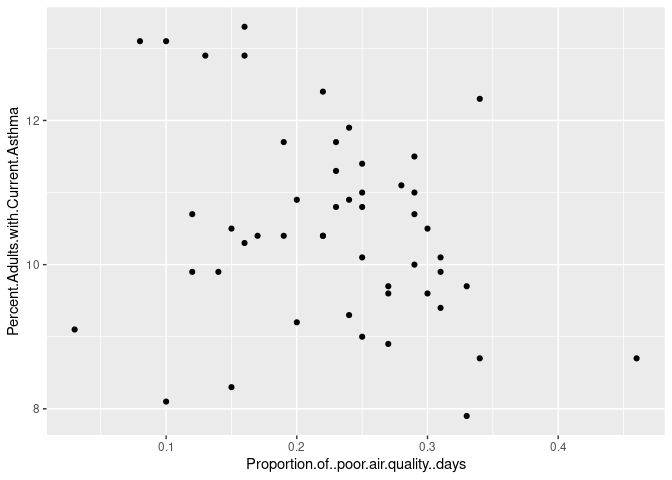

Final Rmarkdown Portfolio
================
Elise Johnson
2025-10-31

- [ABSTRACT](#abstract)
- [BACKGROUND](#background)
- [STUDY QUESTION and HYPOTHESIS](#study-question-and-hypothesis)
  - [Questions](#questions)
  - [Hypothesis](#hypothesis)
  - [Prediction](#prediction)
- [METHODS](#methods)
  - [First analysis](#first-analysis)
  - [Second analysis/plot](#second-analysisplot)

# ABSTRACT

# BACKGROUND

# STUDY QUESTION and HYPOTHESIS

## Questions

Is there a correlation between the proportion of low air quality days
and prevalence of asthma per state?

## Hypothesis

Where you live has an effect on whether you experience asthma or not

## Prediction

I predict that the state you live in does impact your chances of having
asthma. The states with lower air quality will have higher rates of
asthma.

# METHODS

## First analysis

``` r
# code for figure 1
mydata<- read.csv("groupfile.csv")
# library
library(ggplot2)
 
# The iris dataset is provided natively by R
#head(iris)
 
# basic scatterplot
ggplot(mydata, aes(x=Proportion.of..poor.air.quality..days, y=Percent.Adults.with.Current.Asthma)) + 
    geom_point()
```

<!-- -->

## Second analysis/plot

``` r
# DISCUSSION

## Interpretation 1 -


## Interpretation 2 -


# CONCLUSION

# REFERENCES     
```
