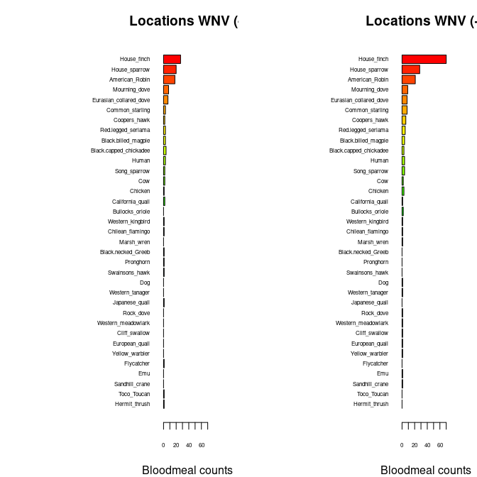

Warm-up mini-Report: Mosquito Blood Hosts in Salt Lake City, Utah
================
Elise Johnson
2025-10-11

- [ABSTRACT](#abstract)
- [BACKGROUND](#background)
- [STUDY QUESTION and HYPOTHESIS](#study-question-and-hypothesis)
  - [Questions](#questions)
  - [Hypothesis](#hypothesis)
  - [Prediction](#prediction)
- [METHODS](#methods)
  - [First analysis](#first-analysis)
  - [Second analysis/plot](#second-analysisplot)
- [DISCUSSION](#discussion)
  - [Interpretation 1 -](#interpretation-1--)
  - [Interpretation 2 -](#interpretation-2--)
- [CONCLUSION](#conclusion)

# ABSTRACT

West Nile Virus is a mosquito borne pathogen that is transferred
primarily from birds to other animals. The question asked was which bird
species are acting as amplifying hosts for WVN? Mosquitos were collected
in different sites near SLC. After performing DNA blood meal sequencing,
PCR, extraction, and data analysis, a positive correlation was found
between locations of house finches and higher rates of West Nile Virus.
These findings support the hypothesis that house finches are amplifying
hosts of WNV.

# BACKGROUND

West Nile Virus is a mosquito bourne virus that is usually transferred
from birds to other animals. It is a Viremia virus, or a virus that
enters the bloodstream, which is why mosquitos are good carriers for it
(ChatGPT). Humans and other animals don’t carry high levels of viremia
in their blood, making them bad amplifying hosts, but birds are known to
have high levels, causing them to often be excellent amplifying hosts.
The viremia duration (Kumar et al., 2003) bar plot shows the
significance of house finches as hosts with the West Nile Virus, as they
appear to be a prominent host for the virus and provides a basis for our
hypothesis that house finches serve as amplifying hosts for WNC. We
predict that locations with more house finches also have higher positive
tests for WNV in mosquito pools.

``` r
# Manually transcribe duration (mean, lo, hi) from the last table column
duration <- data.frame(
  Bird = c("Canada Goose","Mallard", 
           "American Kestrel","Northern Bobwhite",
           "Japanese Quail","Ring-necked Pheasant",
           "American Coot","Killdeer",
           "Ring-billed Gull","Mourning Dove",
           "Rock Dove","Monk Parakeet",
           "Budgerigar","Great Horned Owl",
           "Northern Flicker","Blue Jay",
           "Black-billed Magpie","American Crow",
           "Fish Crow","American Robin",
           "European Starling","Red-winged Blackbird",
           "Common Grackle","House Finch","House Sparrow"),
  mean = c(4.0,4.0,4.5,4.0,1.3,3.7,4.0,4.5,5.5,3.7,3.2,2.7,1.7,6.0,4.0,
           4.0,5.0,3.8,5.0,4.5,3.2,3.0,3.3,6.0,4.5),
  lo   = c(3,4,4,3,0,3,4,4,4,3,3,1,0,6,3,
           3,5,3,4,4,3,3,3,5,2),
  hi   = c(5,4,5,5,4,4,4,5,7,4,4,4,4,6,5,
           5,5,5,7,5,4,3,4,7,6)
)

# Choose some colors
cols <- c(rainbow(30)[c(10:29,1:5)])  # rainbow colors

# horizontal barplot
par(mar=c(5,12,2,2))  # wider left margin for names
bp <- barplot(duration$mean, horiz=TRUE, names.arg=duration$Bird,
              las=1, col=cols, xlab="Days of detectable viremia", xlim=c(0,7))

# add error bars
arrows(duration$lo, bp, duration$hi, bp,
       angle=90, code=3, length=0.05, col="black", xpd=TRUE)
```


# STUDY QUESTION and HYPOTHESIS

## Questions

We would like to know which bird species acts as an amplifying host of
WNV in Salt Lake City.

## Hypothesis

Our hypothesis is that house finches are acting as important amplifying
hosts of WNV in Salt Lake City.

## Prediction

If house finches are acting as important amplifying hosts, we predict
that trapping locations where mosquitoes feed on house finches will also
have higher rates of confirmed WNV in tested mosquito pools.

# METHODS

We took captured mosquitos from the SLC area and smashed them. We
performed a blood meal DNA extraction and then a PCR. We added the lysis
buffer to break down the cell membranes. Then we added the template DNA
and polymerase and primers. They were placed in the Thermocycler and
then the data was analyzed.

## First analysis

Horizontal plots:

``` r
## import counts_matrix: data.frame with column 'loc_positives' (0/1) and host columns 'host_*'
counts_matrix <- read.csv("./bloodmeal_plusWNV_for_BIOL3070.csv")

## 1) Identify host columns
host_cols <- grep("^host_", names(counts_matrix), value = TRUE)

if (length(host_cols) == 0) {
  stop("No columns matching '^host_' were found in counts_matrix.")
}

## 2) Ensure loc_positives is present and has both levels 0 and 1 where possible
counts_matrix$loc_positives <- factor(counts_matrix$loc_positives, levels = c(0, 1))

## 3) Aggregate host counts by loc_positives
agg <- stats::aggregate(
  counts_matrix[, host_cols, drop = FALSE],
  by = list(loc_positives = counts_matrix$loc_positives),
  FUN = function(x) sum(as.numeric(x), na.rm = TRUE)
)

## make sure both rows exist; if one is missing, add a zero row
need_levels <- setdiff(levels(counts_matrix$loc_positives), as.character(agg$loc_positives))
if (length(need_levels)) {
  zero_row <- as.list(rep(0, length(host_cols)))
  names(zero_row) <- host_cols
  for (lv in need_levels) {
    agg <- rbind(agg, c(lv, zero_row))
  }
  ## restore proper type
  agg$loc_positives <- factor(agg$loc_positives, levels = c("0","1"))
  ## coerce numeric host cols (they may have become character after rbind)
  for (hc in host_cols) agg[[hc]] <- as.numeric(agg[[hc]])
  agg <- agg[order(agg$loc_positives), , drop = FALSE]
}

## 4) Decide species order (overall abundance, descending)
overall <- colSums(agg[, host_cols, drop = FALSE], na.rm = TRUE)
host_order <- names(sort(overall, decreasing = TRUE))
species_labels <- rev(sub("^host_", "", host_order))  # nicer labels

## 5) Build count vectors for each panel in the SAME order
counts0 <- rev(as.numeric(agg[agg$loc_positives == 0, host_order, drop = TRUE]))
counts1 <- rev(as.numeric(agg[agg$loc_positives == 1, host_order, drop = TRUE]))

## 6) Colors: reuse your existing 'cols' if it exists and is long enough; otherwise generate
if (exists("cols") && length(cols) >= length(host_order)) {
  species_colors <- setNames(cols[seq_along(host_order)], species_labels)
} else {
  species_colors <- setNames(rainbow(length(host_order) + 10)[seq_along(host_order)], species_labels)
}

## 7) Shared x-limit for comparability
xmax <- max(c(counts0, counts1), na.rm = TRUE)
xmax <- if (is.finite(xmax)) xmax else 1
xlim_use <- c(0, xmax * 1.08)

## 8) Plot: two horizontal barplots with identical order and colors
op <- par(mfrow = c(1, 2),
          mar = c(4, 12, 3, 2),  # big left margin for species names
          xaxs = "i")           # a bit tighter axis padding

## Panel A: No WNV detected (loc_positives = 0)
barplot(height = counts0,
        names.arg = species_labels, 
        cex.names = .5,
        cex.axis = .5,
        col = rev(unname(species_colors[species_labels])),
        horiz = TRUE,
        las = 1,
        xlab = "Bloodmeal counts",
        main = "Locations WNV (-)",
        xlim = xlim_use)

## Panel B: WNV detected (loc_positives = 1)
barplot(height = counts1,
        names.arg = species_labels, 
        cex.names = .5,
        cex.axis = .5,
        col = rev(unname(species_colors[species_labels])),
        horiz = TRUE,
        las = 1,
        xlab = "Bloodmeal counts",
        main = "Locations WNV (+)",
        xlim = xlim_use)
```



``` r
par(op)

## Keep the colors mapping for reuse elsewhere
host_species_colors <- species_colors
```

This plot shows a clear difference between the numbers of house finches
positive and negative for WNV. More house finches test positive for it
rather than negative and there are a greater number of house finches in
the area positive for WNV.

## Second analysis/plot

Salt Lake City Mosquito Abatement Surveillance:

``` r
# second-analysis-or-plot, glm with house finch alone against binary +/_
glm1 <- glm(loc_positives ~ host_House_finch,
            data = counts_matrix,
            family = binomial)
summary(glm1)
```

    ## 
    ## Call:
    ## glm(formula = loc_positives ~ host_House_finch, family = binomial, 
    ##     data = counts_matrix)
    ## 
    ## Coefficients:
    ##                  Estimate Std. Error z value Pr(>|z|)  
    ## (Intercept)       -0.1709     0.1053  -1.622   0.1047  
    ## host_House_finch   0.3468     0.1586   2.187   0.0287 *
    ## ---
    ## Signif. codes:  0 '***' 0.001 '**' 0.01 '*' 0.05 '.' 0.1 ' ' 1
    ## 
    ## (Dispersion parameter for binomial family taken to be 1)
    ## 
    ##     Null deviance: 546.67  on 394  degrees of freedom
    ## Residual deviance: 539.69  on 393  degrees of freedom
    ## AIC: 543.69
    ## 
    ## Number of Fisher Scoring iterations: 4

``` r
#glm with house-finch alone against positivity rate
glm2 <- glm(loc_rate ~ host_House_finch,
            data = counts_matrix)
summary(glm2)
```

    ## 
    ## Call:
    ## glm(formula = loc_rate ~ host_House_finch, data = counts_matrix)
    ## 
    ## Coefficients:
    ##                  Estimate Std. Error t value Pr(>|t|)    
    ## (Intercept)      0.054861   0.006755   8.122 6.07e-15 ***
    ## host_House_finch 0.027479   0.006662   4.125 4.54e-05 ***
    ## ---
    ## Signif. codes:  0 '***' 0.001 '**' 0.01 '*' 0.05 '.' 0.1 ' ' 1
    ## 
    ## (Dispersion parameter for gaussian family taken to be 0.01689032)
    ## 
    ##     Null deviance: 6.8915  on 392  degrees of freedom
    ## Residual deviance: 6.6041  on 391  degrees of freedom
    ##   (2 observations deleted due to missingness)
    ## AIC: -484.56
    ## 
    ## Number of Fisher Scoring iterations: 2

This data shows whether there is a significant correlation between
number of house finches and testing positive for WNV.

# DISCUSSION

## Interpretation 1 -

The bar plot was used to test whether blood meals from house finches
have a greater positive or negative rate for West Nile Virus. It showed
a clear visual difference between the amount of blood from house finches
that were positive for WNV and not. The house finches positive for WNV
were in much greater quantity than the house finches that were negative.
While this supports our hypothesis that house finches act as amplifying
species for WNV, a possible limitation could be the fact that birds only
carry viremia in their blood for a few days. If a bird was tested a few
days after becoming infected, their results may be negative, in turn
misrepresenting the amount of positive infections.

## Interpretation 2 -

The Generalized Linear Model (GLM) was used to test whether our results
of a positive correlation between location of house finches and positive
WNV occurred by chance. We obtained a p value of 4.54e-05. Our data also
showed 3 \*\*\*, which means that our p value was about 0. This can be
interpreted as the probability that our results occurred by chance is
about 0, meaning that there is a significant correlation between house
finches and positive WNV. Areas with more house finches indicate higher
rates of WNV, supporting our hypothesis. A possible limitation could be
other factors involved. One possibility would be that house finches
prefer to live in areas that mosquitos also prefer to live in. An
increased number of mosquitos would mean increased WNV and if there were
more house finches in that particular area, it would appear
correlational when there might not even be a direct correlation.

# CONCLUSION

Our analyses support the hypothesis that house finches serve as
amplifying hosts for West Nile Virus in Salt Lake City. \# REFERENCES

1.  Komar N, Langevin S, Hinten S, Nemeth N, Edwards E, Hettler D, Davis
    B, Bowen R, Bunning M. Experimental infection of North American
    birds with the New York 1999 strain of West Nile virus. Emerg Infect
    Dis. 2003 Mar;9(3):311-22. <https://doi.org/10.3201/eid0903.020628>

2.  ChatGPT. OpenAI, version Jan 2025. Used as a reference for functions
    such as plot() and to correct syntax errors. Accessed 2025-10-11.
